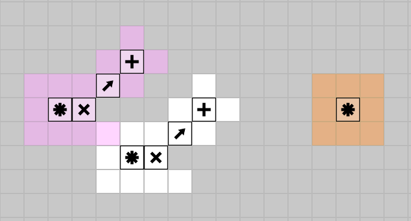

# Cosmic Blocks Bot

A bot for cosmic blocks, a game by Narcissa Wright

<p align="center">
    
</p>

## Usage

```
git clone https://github.com/stevengeeky/bot-cosmicblocks
cd bot-cosmicblocks
npm install
```

Then open `index.html` in a browser

You are very welcome to contribute. This bot is standalone and the idea is to eventually integrate it with the cuddle.zone API. For now, this code runs entirely on the clientside, and is written in JavaScript.

## The bot

You are player 1 (left base); the bot is player 2 (right base). Click a square, then click a block from the stock to place it. Both blocks land in the same round: if you and the bot pick the same square the tiles collide and neither is spent. A base falls when both networks stand on it; if both fall on the same turn it is a draw. The winning route lights up and replays until you start a new game.

The bot lives in `opponent.js` (`bot.js` holds the original board and distance helpers). Everything it learns is kept in `localStorage`, so it survives closing the tab:

- **Prediction.** Every move it builds a probability matrix over the blank squares: a general prior (players push out from their own base toward the other, onto squares adjacent to something placed) blended with what *you* have actually done. It keeps a table of the squares you take, as offsets from your own base, and a table of your *stride*, where you go relative to the square you took last turn. The blend leans on the learned tables as they fill. The overlay on the board is that matrix, coloured by which side's road actually reaches each square; the readout shows its best guess, how many of your moves it has called, and your current run of moves it did not see coming.
- **Threat counting.** Before scoring anything it lists every square where one of your remaining tiles would finish your road to its base, and sitting on one of those outweighs every other term. If it has a winning square of its own, it takes it.
- **Situation learning.** The position is bucketed into a coarse signature (who is closer, how much board is down, whether you can connect next turn). For each bucket it keeps three weightings, rush / wall / safe, and picks between them on what has won from that bucket before, optimistic about the ones it has barely tried. At the end of a game every bucket the game passed through is credited with the result.
- **Move scoring.** Each candidate (square x tile type) is scored on how much closer it brings the bot, how much further it pushes you, and the chance you take that square this turn. On top of that: forks (two ways to win next turn cannot both be blocked), blocks that also build rather than hand you new cells, no hedging off a square that sets up its own win, and a coin flip among near-equal moves so it does not become a lookup table. The readout names which of these moved the last piece.

### Sounds

Sounds are optional. `main.js` looks for `sfx/move3.ogg`, `collision3.ogg`, `youwin.ogg`, `gameover.ogg`, `drawgame.ogg`, `newgame.ogg` and `hover.ogg` (the names used by the original game's client). The folder is not part of this repo; if the files are missing the game is simply silent. Drop them into `sfx/` to enable them.
